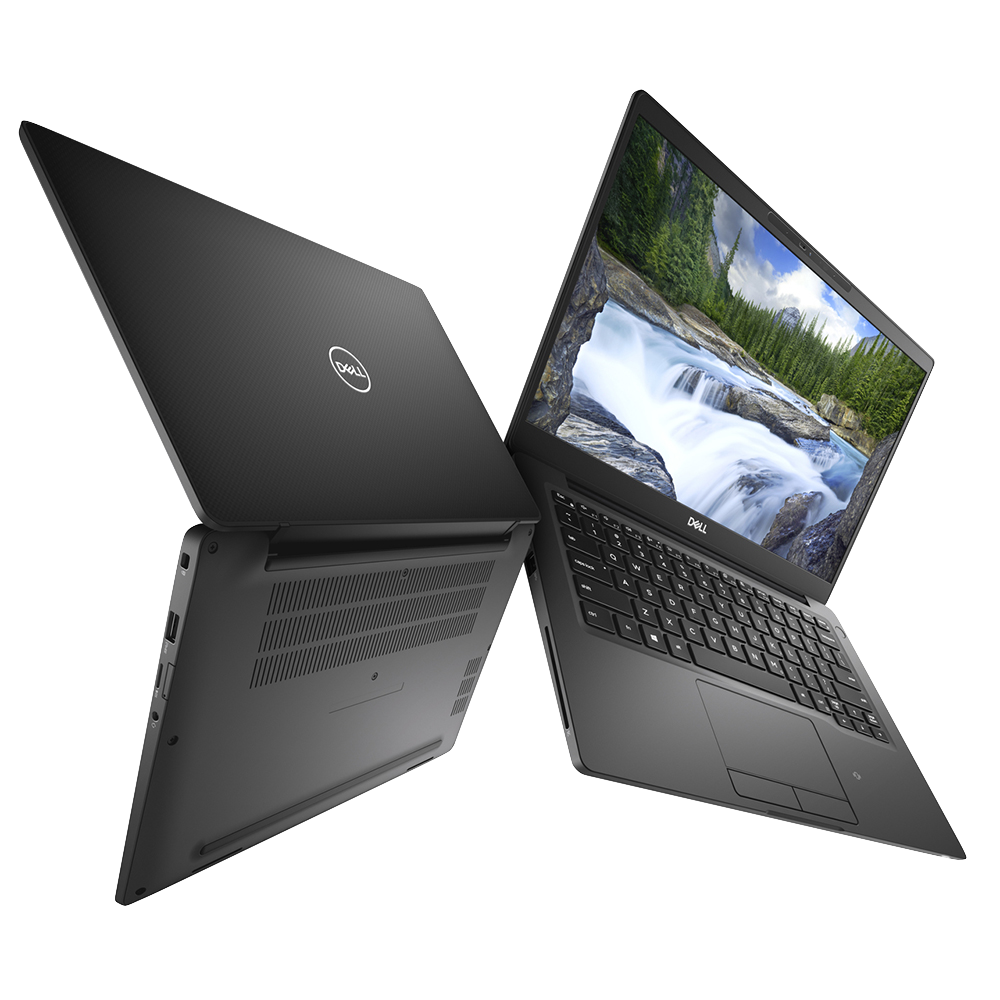
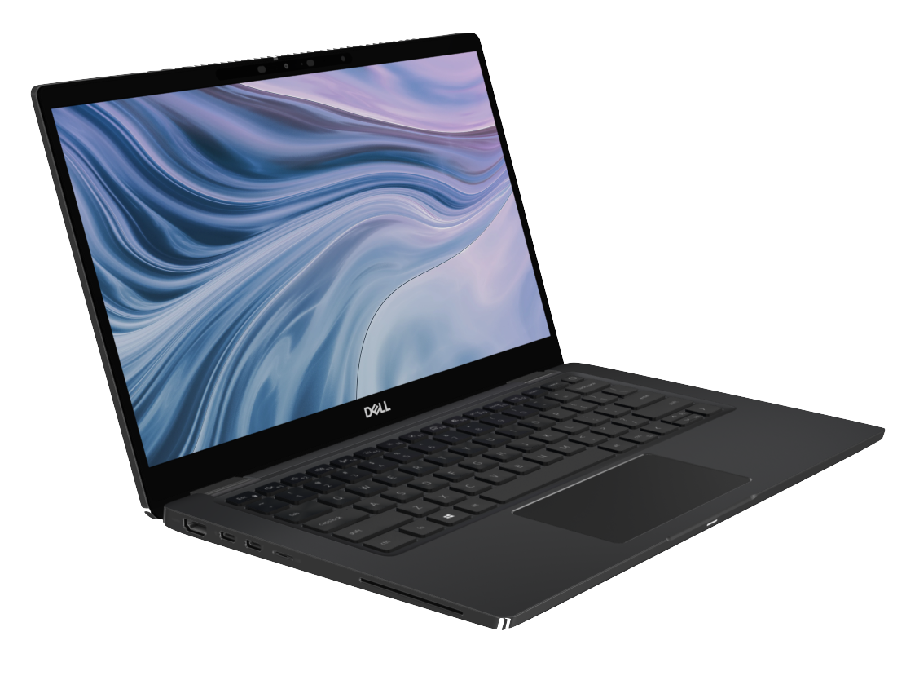

# EFI for Dell Latitude 7300 - Opencore
## Opencore 1.0.3
## macOs Sequoia 15.3.1 (c)

## Specs:

  - **CPU:** Intel® Core™ i7-8665U Processor
  - **GPU:** Intel UHD Graphics 620 (Whiskey Lake) @ 2048 MB
  - **Memory:** 32 GB RAM 2666 MHz
  - **Disk:** SSDPEKKF256G8 NVMe INTEL 256GB
  - **Screen Resolution:** 1920 x 1080 - Touch 
  - **BIOS:** 1.37
  - **Wifi:** Intel® Wireless-AC 9560
  - **Audio:** Realtek ALC295
  - **SMBIOS:** MacBookPro15,2

## Works:

  * Battery
  * HDMI output up to 2 screens
  * Audio - Manual Run ALCPlugFix
  * FN Sound/Brightness shortcuts
  * WiFi 
  * Bluetooth
  * Trackpad - All the gestures
  * SD Card Reader - Realtek

## Doesn't Work:
  * AirDrop

### Notes:
* [GeekBench 6 Score](https://browser.geekbench.com/v6/cpu/4099903)

### Credits:
* [Based on cropester 7300 EFI](https://osxlatitude.com/forums/topic/18195-dell-latitude-7300-bad-audio-with-alc295-alc3254/)
  * [EFI](https://mega.nz/file/OQIXBJib#aBZ-m8NzIPAEOjHF5g3QRzad9SzBQJkj0FM21iumteg)
